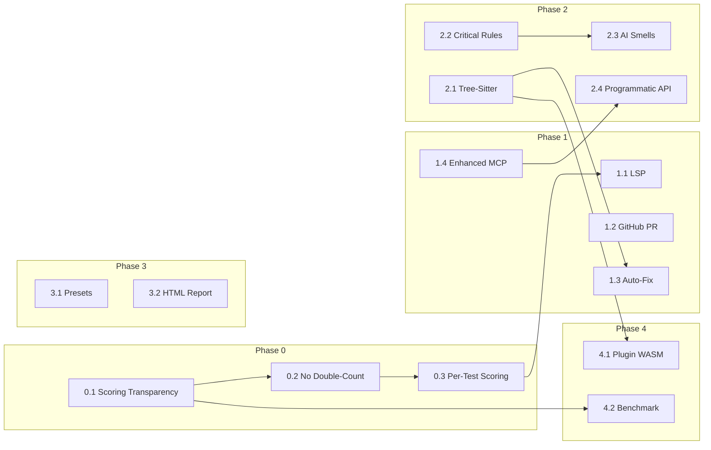

# Rigor Roadmap: Path to World-Class

> A strategic roadmap to make Rigor the definitive test quality tool for the TypeScript ecosystem — for humans and AI alike.

---

## Table of Contents

- [Vision](#vision)
- [Current Capabilities](#current-capabilities)
- [Progress Summary (Phases 0–2 complete)](#progress-summary-phases-02-complete)
- [Current State Assessment](#current-state-assessment)
- [Dependency Overview](#dependency-overview)
- [Phase 0: Foundation](#phase-0-foundation--trust-the-score)
- [Phase 1: Developer Experience](#phase-1-developer-experience--make-it-indispensable)
- [Phase 2: Intelligence](#phase-2-intelligence--deeper-smarter-analysis)
- [Phase 3: Ecosystem](#phase-3-ecosystem--build-the-community)
- [Phase 4: Platform & Plugins](#phase-4-platform--plugins)
- [Phase 5: Enterprise & Scale](#phase-5-enterprise--scale)
- [Competitive Landscape](#competitive-landscape)
- [Risks and Mitigations](#risks-and-mitigations)
- [Feedback and Iteration](#feedback-and-iteration)
- [Release and Versioning Strategy](#release-and-versioning-strategy)
- [Success Metrics](#success-metrics)
- [Summary](#summary)
- [Appendix: Rule Tables](#appendix-rule-tables)
- [Appendix: Architecture Decisions](#appendix-architecture-decisions)

---

## Vision

Every TypeScript team — and every AI agent writing tests — uses Rigor as their quality gate. Not because they're told to, but because the feedback is instant, trustworthy, and actionable.

---

## Current Capabilities

What exists today (as of **v1.0**; Phase 0, Phase 1, and Phase 2 complete). Roadmap items below are labeled **Extend** (build on this) or **Build new** (net-new work).

| Capability | Status | Location / Notes |
|------------|--------|------------------|
| **34 active rules + 10 planned** | Implemented / Partial | `src/analyzer/` — 34 active rules (assertion quality, error coverage, boundary, isolation, input variety, RTL, async, mocks, flaky, **6 AI smell rules**); 10 critical rules (test-complexity, vacuous-test, etc.) have stubs but incomplete detection; heuristics hardened post-v1.0 (flaky detection, mock abuse, framework detection, async end-line) |
| **Scoring (0–100, 6 categories)** | Implemented | Transparent breakdown: assertion quality, error coverage, boundary conditions, test isolation, input variety, **AI Smells**; test-type weights; per-test scores; no double-counting; proportional no-source scaling; no-assertion floor (30/F); per-test/file-level cap |
| **Tree-sitter integration** | Implemented | Shared query cache; 10+ rules use tree-sitter queries; `src/parser/queries.rs` |
| **Framework detection** | Implemented | Jest, Vitest, Playwright, Cypress, Mocha — auto or config |
| **Source file analysis** | Implemented | Maps test files to source; coverage gaps, missing error/boundary tests |
| **Mutation testing** | Implemented | `src/mutation/` — quick/medium/full modes, batch support |
| **MCP server (9 tools)** | Implemented | `analyze_test_quality`, `suggest_improvements`, `get_mutation_score`, `analyze_with_source`, `get_improvement_plan`, `explain_rule`, `iterate_improvement`, `get_test_template`, `compare_tests`; **AI feedback** when AI smells detected |
| **Auto-fix** | Implemented | `--fix` / `--fix-dry-run` for debug-code, focused-test; fix metadata in JSON/SARIF |
| **AI suggestions** | Implemented | `src/suggestions/` — Claude API, `RIGOR_APPLY_CMD`, improvement prompts |
| **LSP / VS Code** | Implemented | `rigor-lsp` crate, `vscode-rigor` extension |
| **GitHub Action** | Implemented | `rigor-action` composite action for PR comments with score delta and annotations |
| **Programmatic API** | Implemented | Stable JSON contract; `--stdin` / `analyze_source()` for in-memory analysis; **docs/api.md**; **Node.js SDK** (`sdk/node` as `@rigor/sdk`) |
| **Score history** | Implemented | `history.rs` — trends per run |
| **CLI: watch, cache, Git** | Implemented | `--watch`, caching, `--staged`, `--changed` |
| **Output formats** | Implemented | Console, JSON, SARIF (with breakdown, per-test scores) |
| **Configuration** | Implemented | `.rigorrc.json`, `rigor init`, rule severity, ignore patterns |
| **CI integration** | Implemented | GitHub Actions, SARIF for Code Scanning |
| **Presets / plugins** | Not implemented | Phase 3+ |

---

## Progress Summary (Phases 0–2 complete, post-v1.0 hardening done)

| Phase | Status | Delivered |
|-------|--------|-----------|
| **Phase 0** | ✅ Done | Transparent 6-category breakdown, no double-counting, per-test scoring; scoring docs and alignment tests |
| **Phase 1** | ✅ Done | LSP + VS Code extension, rigor-action (GitHub PR), auto-fix (debug-code, focused-test), 6 new MCP tools (v1.0) |
| **Phase 2.1** | ✅ Done | Shared tree-sitter query cache; 10+ rules migrated to queries |
| **Phase 2.2** | 🔶 Partial | 10 critical rules added as stubs; detection logic pending for most (see docs/rules.md) |
| **Phase 2.3** | ✅ Done | 6 AI smell rules; AI Smells category; MCP AI feedback |
| **Phase 2.4** | ✅ Done | Stable JSON API; `--stdin` / `analyze_source()`; docs/api.md; Node.js SDK (`sdk/node`) |
| **Post-v1.0 hardening** | ✅ Done | Critical bug fixes, scoring calibration, heuristic hardening, semantic tests (see below) |
| **Phase 3+** | Pending | Presets, HTML report, plugin API, benchmark, monorepo, trends |

### Post-v1.0 Hardening (completed)

A deep code review identified and fixed critical issues across the entire stack:

**Critical bug fixes (P0):**
- Fixed npm installer async bug — `main()` now awaits downloads
- Fixed version mismatch — all packages aligned to 1.0.0
- Fixed binary name mismatch — platform map translates Node.js conventions to CI artifact names
- Fixed GitHub Action silent failure — removed `2>/dev/null`, `|| true`, `continue-on-error`
- Resolved documentation contradictions about Phase 2.2 rule status

**Scoring calibration:**
- Removed scoring v1 (double-counting bug) — v2 is now the only algorithm
- Fixed "no source = free points" — source-dependent categories use proportional scaling (score × 15/25) when source unavailable, preserving issue deductions while preventing inflation
- Added no-assertion test floor — tests with 0 assertions capped at 30/F
- Per-test aggregation capped by file-level breakdown — prevents inflated per-test averages from overriding poor file-level quality
- Per-test display scores scaled proportionally to file score — eliminates confusing "all tests B but file is F" disconnect
- Transparent breakdown display shows per-test cap step when it changes the final score
- Increased penalty constants (Error: 7, Warning: 3) with documented rationale

**Heuristic hardening (false-positive reduction):**
- Fixed flaky pattern detection — replaced "line has any digit" with actual numeric delay argument detection for setTimeout/setInterval
- Fixed mock abuse detection — exact match on final path segment instead of `contains()` substring (no more `UserMap` matching `Map`)
- Fixed framework detection fallback — bare `expect()` returns `Unknown`, not `Jest`
- Fixed async test end-line guessing — removed +49 line default, falls back to start line only
- Added Cypress `.and()` as assertion alias for `.should()`

**Testing infrastructure:**
- Added 9 semantic scoring tests that validate scoring *intent* (e.g. "no-assertions should score below 40", "score ordering matches quality ordering")
- Fixed edge case tests that silently accepted both Ok and Err
- Consolidated test file detection — LSP uses shared `TestWatcher::is_test_file()`
- Updated Node SDK types from `unknown` to fully typed interfaces

---

## Current State Assessment

Rigor has completed Phase 0–2 plus a thorough post-release hardening cycle: transparent scoring (6 categories, per-test, calibrated), LSP/VS Code, GitHub Action, auto-fix, 38+ rules (including AI smells) with reduced false-positive rates, 9 MCP tools with AI feedback, and a programmatic API (CLI `--stdin`, Rust `analyze_source`, Node SDK). 355 tests pass (unit, integration, regression, CLI, edge-case, watcher, MCP). Remaining gaps:

| Area | Current State | World-Class Standard |
|------|--------------|---------------------|
| **Scoring** | ✅ Transparent, per-test, 6 categories, calibrated (no-source scaling, assertion floor, per-test cap) | Empirically validated on benchmark (Phase 4) |
| **Rules** | 38+ rules, tree-sitter where migrated; heuristics hardened; no plugins | Plugin ecosystem, more rules auto-fixable, 10 stub rules need detection logic |
| **Editor** | ✅ LSP + VS Code, shared test file detection | Real-time diagnostics in place |
| **AI Integration** | ✅ MCP 9 tools, programmatic API, Node SDK (fully typed) | Rate limiting, streaming, Python SDK (optional) |
| **Ecosystem** | Standalone + API + SDK | Presets, plugins, shared configs (Phase 3+) |
| **Testing** | ✅ 355 tests, 9 semantic scoring tests, regression baselines | Benchmark dataset for external validation (Phase 4) |

---

## Dependency Overview

The following diagram shows key dependencies between deliverables. Items should be implemented in an order that respects these links (or MVP scope should be chosen to avoid blocking).



| Item | Prerequisites |
|------|----------------|
| 0.2 Eliminate double-counting | 0.1 (transparent breakdown first) |
| 0.3 Per-test scoring | 0.2 (single scoring model) |
| 1.1 LSP | 0.3 (per-test scoring makes inline diagnostics actionable) |
| 1.3 Auto-fix | 2.1 (AST-aware rules required for safe fixes) |
| 1.4 Enhanced MCP | Existing MCP server (extend) |
| 2.3 AI smells | 2.2 (foundation rules) |
| 2.4 Programmatic API | Existing CLI/engine (extend) |
| 4.1 Plugin API | 2.1 (stable AST from tree-sitter) |
| 4.2 Benchmark dataset | Phase 0 complete (trustworthy scoring) |

### Visual timeline

```mermaid
gantt
  title Rigor roadmap (weeks)
  dateFormat X
  axisFormat %s

  section Phase0
  Foundation (0.1–0.3)    :phase0, 0, 4

  section Phase1
  DX + MCP (1.1–1.4)      :phase1, 4, 10

  section Phase2
  Intelligence + API      :phase2, 10, 19

  section Phase3
  Presets + HTML          :phase3, 19, 26

  section Phase4
  Plugin + Benchmark      :phase4, 26, 37

  section Phase5
  Enterprise              :phase5, 37, 45
```



---

## Phase 0: Foundation — Trust the Score

**Timeline: Weeks 1–4** | **Effort: M (2–3 weeks for 1 dev)** | **Theme: If teams don't trust the score, nothing else matters.**

### 0.1 — Fix Scoring Transparency

**Type:** Extend (existing scoring engine) | **Prerequisites:** None

**MVP:** Console + JSON breakdown; no `--verbose` trace. **Full:** As below. **Cut if slip:** `--verbose` issue-to-category mapping.

**What:** Restructure the scoring output to show a full breakdown — category scores, weights applied, penalties deducted — so every point is traceable.

**Why:** Today, users see `Score: 72/100 (C)` with no explanation. Engineering teams won't gate CI on a number they can't audit. Transparency is the single biggest trust-builder.

**Impact:** Transforms Rigor from "opaque linter" to "diagnostic tool I can reason about." Teams that understand the score will tune it, adopt it in CI, and advocate for it internally.

**Deliverables:**
- Console output includes category breakdown (e.g., `Assertion Quality: 18/25, Error Coverage: 22/25, ...`)
- JSON/SARIF output includes full `breakdown` object with per-category scores, weights, and penalties
- `--verbose` shows which issues contributed to which category deductions

### 0.2 — Eliminate Double-Counting

**Type:** Extend (refactor scoring) | **Prerequisites:** [0.1](#01--fix-scoring-transparency)

**MVP:** Refactored scoring with no double-count; unit tests. **Full:** As below. **Cut if slip:** N/A (core to trust).

**What:** Decouple category scoring from issue penalties. Category scores should reflect positive signal (what the tests do well). Issue penalties should reflect negative signal (specific problems found). They must not overlap.

**Why:** Currently, a weak assertion lowers the assertion quality category score AND triggers a -2 warning penalty. The same problem is penalized twice, making scores feel arbitrary and punitive. Teams that investigate the math will lose trust.

**Impact:** Scores become predictable and fair. A team that fixes issue X sees exactly the expected score improvement, building confidence in the system.

**Deliverables:**
- Refactored `scoring.rs` with clear separation between positive scoring and penalty deductions
- Each issue maps to exactly one scoring impact (either category or penalty, not both)
- Unit tests verifying no double-counting across all 28 rules

### 0.3 — Per-Test Scoring

**Type:** Build new | **Prerequisites:** [0.2](#02--eliminate-double-counting)

**MVP:** Per-test scores in JSON only; file score still primary in console. **Full:** As below. **Cut if slip:** Console "weakest tests first" ordering.

**What:** Score individual tests within a file, not just the file as a whole.

**Why:** A file with 9 excellent tests and 1 terrible test gets a mediocre file-level score. This is misleading and frustrating. Developers need to know *which specific test* to fix. AI agents need to know *which generated test* to regenerate.

**Impact:** Unlocks precise, actionable feedback. Instead of "this file is a C," Rigor says "tests 1–9 are A-grade; test 10 is F-grade because it has no assertions and a vague name." This is the level of granularity that drives actual test improvements.

**Deliverables:**
- `TestScore` struct with per-test breakdown
- File score derived from aggregation of test scores (weighted by test complexity)
- JSON output includes `tests[]` array with individual scores and issues
- Console output highlights the weakest tests first

---

## Phase 1: Developer Experience — Make It Indispensable

**Timeline: Weeks 5–14** | **Effort: L (8–10 weeks for 1–2 devs)** | **Theme: Meet developers where they are — the editor and the PR.**

### 1.1 — VS Code Extension with LSP

**Type:** Build new | **Prerequisites:** [0.3](#03--per-test-scoring) (recommended for actionable diagnostics)

**MVP:** Diagnostics on save only, no code actions, no hover. **Full:** As below. **Cut if slip:** Hover and status bar.

**What:** Build a Language Server Protocol (LSP) implementation wrapping Rigor's analysis engine, and a VS Code extension that surfaces diagnostics inline.

**Why:** World-class linters (ESLint, Biome, Clippy) provide real-time feedback as you type. A CLI-only tool is a second-class citizen — developers have to remember to run it, context-switch to the terminal, and map output back to code. An LSP makes Rigor a seamless part of the editing experience.

**Impact:** This is the single highest-impact initiative for adoption. Inline squiggles, hover explanations, and code actions turn Rigor from "a thing I run sometimes" into "a thing that's always guiding me." It also makes Rigor visible — every developer on the team sees it, not just whoever configured CI.

**Deliverables:**
- LSP server binary (Rust, using `tower-lsp` or `lsp-server` crate)
- VS Code extension (TypeScript wrapper) published to the VS Code Marketplace
- Real-time diagnostics on save (with debouncing)
- Hover information on issues (rule explanation, fix suggestion)
- Code actions for auto-fixable rules (see 1.3)
- Configuration via `.rigorrc.json` (auto-detected)
- Score display in status bar

### 1.2 — GitHub PR Integration

**Type:** Build new | **Prerequisites:** None (uses existing CLI)

**MVP:** PR comment with score delta and per-file changes only. **Full:** As below. **Cut if slip:** Inline annotations, monorepo per-package comments.

**What:** A GitHub Action that posts a PR comment summarizing Rigor results — score changes per file, new issues introduced, and inline annotations on the diff.

**Why:** CI exit codes are binary (pass/fail) and logs are buried. A PR comment with "This PR dropped `auth.test.ts` from B (84) to D (62): 3 new weak assertions, 1 missing error test" is immediately actionable. It also creates social accountability — the whole team sees test quality in every review.

**Impact:** Makes test quality visible at the exact moment it matters most — code review. Prevents quality regressions before they merge. Creates a culture of test quality without requiring manual enforcement.

**Deliverables:**
- `rigor-action` GitHub Action (composite action using the CLI)
- PR comment with: overall score delta, per-file changes, new issues
- Inline annotations on changed lines (via GitHub Checks API or SARIF)
- Configurable: comment threshold, annotation severity filter, score comparison base
- Support for monorepos (per-package comments)

### 1.3 — Auto-Fix for Simple Rules

**Type:** Extend (existing `--fix` / suggestions; add in-place edits) | **Prerequisites:** [2.1](#21--deep-tree-sitter-integration) (AST-aware rules needed for safe fixes; can ship subset with current rules first)

**MVP:** `--fix` and `--fix-dry-run` for 2–3 safest rules (e.g. focused-test, debug-code). **Full:** As below. **Cut if slip:** LSP code actions, weak-assertion fix.

**What:** Implement `--fix` that automatically corrects simple issues in-place, similar to `eslint --fix`.

**Why:** Detection without remediation creates friction. If Rigor can tell me `toBeDefined()` should be `toBe(expectedValue)`, it should also be able to make that change. Every auto-fixable rule reduces the effort required to achieve a good score, lowering the barrier to adoption.

**Impact:** Dramatically reduces the time from "Rigor found 15 issues" to "all 15 issues fixed." Especially powerful in CI with `--fix --staged` for pre-commit hooks that auto-correct before the developer even knows there was a problem.

**Auto-fixable rules (initial set):**
| Rule | Fix |
|------|-----|
| `debug-code` | Remove `console.log`, `.only`, `debugger` |
| `focused-test` | Replace `it.only` / `fdescribe` with `it` / `describe` |
| `missing-await` | Add `await` before async assertions |
| `rtl-prefer-screen` | Replace `getByRole(...)` with `screen.getByRole(...)` |
| `rtl-prefer-user-event` | Replace `fireEvent.click(...)` with `await userEvent.click(...)` |
| `weak-assertion` | Suggest stronger assertion (with placeholder for expected value) |

**Deliverables:**
- `--fix` flag that applies auto-fixes and re-reports
- `--fix-dry-run` flag that shows what would change without modifying files
- Fix metadata in JSON/SARIF output (replacement text, range)
- LSP code actions for all auto-fixable rules

### 1.4 — Enhanced MCP Server

**Type:** Extend (existing MCP server with `analyze_test_quality`, `suggest_improvements`, `get_mutation_score`) | **Prerequisites:** None

**MVP:** Add 3 new tools (e.g. `analyze_with_source`, `get_improvement_plan`, `explain_rule`). **Full:** As below. **Cut if slip:** Conversation memory, compare_tests.

**What:** Expand the MCP server to a comprehensive AI assistant interface so AI tools get not just "what's wrong" but "what good looks like" for this codebase.

**Why:** AI assistants need more context to write good tests. Enhancing MCP early serves the AI-native growth vector with relatively low effort.

**Impact:** Makes Rigor the go-to MCP tool for test-related work in Cursor, Continue, Cline.

**Deliverables:**
- 6 new MCP tools with full JSON schemas: `analyze_with_source`, `get_improvement_plan`, `explain_rule`, `iterate_improvement`, `get_test_template`, `compare_tests`
- Context-aware suggestions (source file analysis, framework detection, project config)
- Conversation memory within a session (iterative improvement tracking)
- MCP tool documentation and integration guides for Cursor, Continue, Cline

---

## Phase 2: Intelligence — Deeper, Smarter Analysis

**Timeline: Weeks 15–24** | **Effort: L (8–10 weeks for 1–2 devs)** | **Theme: Move from pattern-matching to genuine understanding.**  
**Status: ✅ Complete** (2.1–2.4 delivered)

### 2.1 — Deep Tree-Sitter Integration ✅

**Type:** Extend (tree-sitter already used for parsing) | **Prerequisites:** None  
**Delivered:** Shared query cache (`parser/queries.rs`), 10+ rules using tree-sitter queries (e.g. console, debugger, focused-test).

**MVP:** Migrate 10 highest-impact rules to tree-sitter queries; shared query cache. **Full:** As below. **Cut if slip:** All 28 rules migrated in one phase.

**What:** Replace regex/string-matching rule implementations with tree-sitter query API patterns. Use AST-aware analysis throughout.

**Why:** Most rules currently scan source text with regex — fragile, prone to false positives, and unable to understand structure. Tree-sitter's S-expression query language can match complex AST patterns with precision. Rigor already pays the cost of parsing with tree-sitter but barely uses the result.

**Impact:** Dramatically reduces false positives and false negatives. Rules become robust against formatting differences, comment placement, and unusual but valid syntax. This is the difference between a toy linter and a production-grade tool.

**Example transformation:**

Current (`assertion_intent.rs`):
```
// String matching on test names — fragile
if test_name.contains("error") || test_name.contains("throw") { ... }
```

With tree-sitter queries:
```
// AST pattern matching — precise
(call_expression
  function: (member_expression property: (property_identifier) @method)
  arguments: (arguments (arrow_function body: (statement_block) @body))
  (#match? @method "^(it|test)$"))
```

**Deliverables:**
- Tree-sitter query patterns for all 28 rules
- Shared query compilation cache (queries compiled once, reused per file)
- Benchmark showing accuracy improvement: baseline FP/FN rates documented; target &lt;5% false positive rate (see [Per-phase success criteria](#per-phase-success-criteria))
- Migration of at least the 10 highest-impact rules

### 2.2 — Missing Critical Rules 🔶

**Type:** Build new | **Prerequisites:** [2.1](#21--deep-tree-sitter-integration) (tree-sitter-based detection)  
**Status:** 10 rule stubs added to the enum and config schema. Most return `vec![]` and are excluded from scoring. Detection logic needs to be implemented for: test-complexity, implementation-coupling, vacuous-test, incomplete-mock-verification, async-error-mishandling, redundant-test, unreachable-test-code, excessive-setup, type-assertion-abuse, missing-cleanup. See `docs/rules.md` for per-rule status.

**What:** Add rules that detect the most impactful test quality problems not currently covered.

**Why:** The current 28 rules miss several categories of test problems that experienced engineers immediately recognize. Closing these gaps makes Rigor credible with senior engineers and tech leads — the people who make adoption decisions.

**New rules and rationale:** 10 rules across maintainability, design, correctness, efficiency, TypeScript, and reliability. See [Appendix: Missing critical rules](#missing-critical-rules) for the full table.

**Deliverables:**
- 10 new rules with tree-sitter query-based detection
- Documentation with examples for each rule
- Integration into scoring categories
- Configurable severity for all new rules

### 2.3 — AI-Specific Test Smell Detection ✅

**Type:** Build new | **Prerequisites:** [2.2](#22--missing-critical-rules) (foundation rules)  
**Delivered:** 6 AI smell rules (tautological assertion, over-mocking, shallow variety, happy-path-only, parrot assertion, boilerplate padding); AI Smells category in scoring; MCP returns `aiFeedback` when AI smells detected.

**MVP:** 3–4 AI smell rules with &lt;10% false positive rate on human-written tests. **Full:** As below. **Cut if slip:** Parrot assertion, boilerplate padding.

**What:** A rule category specifically targeting antipatterns common in AI-generated tests.

**Why:** AI-generated tests have distinct failure modes that human-written tests rarely exhibit. As AI test generation becomes ubiquitous, being the tool that catches AI-specific antipatterns is a massive differentiator. No other tool in the ecosystem targets this.

**AI-specific antipatterns:** 6+ patterns (tautological assertion, over-mocking, shallow variety, happy-path-only, parrot assertion, boilerplate padding). See [Appendix: AI-specific antipatterns](#ai-specific-antipatterns) for the full table.

**Impact:** Positions Rigor as the essential quality gate for AI-assisted development workflows. Teams adopting Copilot, Cursor, or other AI coding tools need assurance that generated tests actually work. This is a wide-open market niche.

**Deliverables:**
- `ai-smell` rule category with 6+ sub-rules
- Detection tuned to minimize false positives on human-written tests
- Documentation explaining each AI antipattern with before/after examples
- MCP server enhanced to return AI-specific feedback
- Acceptance: AI smell rules &lt;10% false positive rate on curated human-written test set

### 2.4 — Programmatic API for AI Workflows ✅

**Type:** Extend (CLI and engine exist) | **Prerequisites:** None  
**Delivered:** Stable JSON contract (file path or stdin); `AnalysisEngine::analyze_source()`; CLI `--stdin` / `--stdin-filename`; **docs/api.md**; Node.js SDK in `sdk/node` (`@rigor/sdk`). Deferred: streaming, Python SDK, rate limiting.

**MVP:** Stable JSON contract (input: test source + config; output: score, issues, suggestions). **Full:** As below. **Cut if slip:** SDK wrappers, streaming, rate limiting.

**What:** A stable, documented programmatic interface (beyond CLI) for embedding Rigor in AI pipelines.

**Why:** AI test generation tools need a quality gate between "generate" and "commit." Rigor should be that gate.

**Impact:** Primary growth vector — embeds Rigor into the fastest-growing workflow in software engineering.

**Deliverables:**
- Stable JSON API contract (input: test source + source file + config; output: score, issues, suggestions)
- Streaming support for large batch analysis
- Structured improvement instructions and "What's missing" analysis
- SDK wrappers: Node.js (`@rigor/sdk`), Python (`rigor-sdk`)
- Rate limiting and caching for high-throughput AI pipelines

---

## Phase 3: Ecosystem — Build the Community

**Timeline: Weeks 25–32** | **Effort: M (6–8 weeks for 1–2 devs)** | **Theme: A tool is only as strong as its ecosystem.**

### 3.1 — Shareable Config Presets

**Type:** Build new | **Prerequisites:** None

**MVP:** Built-in presets (`rigor:recommended`, `rigor:strict`, `rigor:legacy`) only. **Full:** As below. **Cut if slip:** `extends` for npm configs, init wizard.

**What:** Ship opinionated, named configurations that teams can extend.

**Why:** Configuration is a barrier to adoption. New users shouldn't have to decide which of 38+ rules to enable at what severity. Presets encode expert opinions: "For a React app, these are the rules and thresholds that matter." This is the same pattern that made `eslint:recommended` and `airbnb` style guide successful.

**Presets:**

| Preset | Focus | Key Rules |
|--------|-------|-----------|
| `rigor:recommended` | Balanced defaults for any TypeScript project | All rules at documented default severities, threshold 70 |
| `rigor:strict` | Maximum quality enforcement | All rules at error severity, threshold 85 |
| `rigor:react` | React/component testing best practices | RTL rules elevated, component isolation emphasized |
| `rigor:api` | Backend/API testing patterns | Error coverage and boundary conditions emphasized, RTL rules off |
| `rigor:ai-review` | Quality gate for AI-generated tests | AI smell rules at error, tautological/shallow variety checks enforced |
| `rigor:legacy` | Gradual adoption for existing codebases | Lenient thresholds, info-only severity, focus on highest-impact rules |

**Impact:** Reduces time-to-value from "read all the docs" to "extend a preset." Creates opinionated community standards around test quality. Enables progressive adoption (start with `legacy`, graduate to `recommended`, aim for `strict`).

**Deliverables:**
- Built-in presets shipped with the binary
- `extends` support for npm-published configs (`extends: "rigor-config-company"`)
- `rigor init` wizard that asks project type and recommends a preset
- Documentation for each preset explaining the philosophy and rule choices

### 3.2 — Interactive HTML Report

**Type:** Extend (uses existing analysis and `history.rs`) | **Prerequisites:** None

**MVP:** Single HTML file with project score and per-file drill-down. **Full:** As below. **Cut if slip:** Trend chart, PNG export, hotspot viz.

**What:** `rigor --html` generates a self-contained HTML file with a visual dashboard of test quality across the project.

**Why:** CLI output is ephemeral and hard to share. JSON is for machines. Teams need a visual artifact they can share in Slack, attach to sprint reviews, or bookmark for trend tracking. Quality dashboards create visibility and accountability.

**Impact:** Makes test quality a team-level metric, not just a CI gate. Managers and tech leads get visibility without running CLI commands. Historical trend data (from `history.rs`) becomes visual and actionable.

**Deliverables:**
- Single self-contained HTML file (inline CSS/JS, no external dependencies)
- Project-wide score dashboard with grade distribution
- Per-file drill-down with issue details
- Score trend chart (last 50 runs from history data)
- Issue hotspot visualization (which rules trigger most often)
- Filterable issue list (by severity, category, file)
- Exportable as PNG for presentations

---

## Phase 4: Platform & Plugins

**Timeline: Weeks 33–44** | **Effort: XL (10–12 weeks for 2 devs; Plugin alone is 3–6 months)** | **Theme: Product into platform; empirical credibility.**

### 4.1 — Plugin / Custom Rule API

**Type:** Build new | **Prerequisites:** [2.1](#21--deep-tree-sitter-integration) (stable AST API)

**MVP:** Plugin API spec + WASM runtime + one example plugin. **Full:** As below. **Cut if slip:** Multiple example plugins, init --plugin.

**What:** Design and implement a rule plugin system that allows third parties to write custom rules.

**Why:** ESLint's ecosystem is its moat. Rigor with plugins serves every specific case (fintech, React, API teams). Deferred until after tree-sitter migration and proven adoption.

**Impact:** Transforms Rigor from a product into a platform. Community plugins drive adoption.

**Design considerations:**
- Plugins defined as WASM modules (language-agnostic, sandboxed, portable) — see [ADR: WASM for plugins](#adr-wasm-for-plugins)
- Plugin API exposes: parsed AST, test metadata, source file info, issue reporting
- Plugin registry (npm packages with `rigor-plugin-*` naming convention)
- Plugin configuration via `.rigorrc.json` `plugins` field

**Deliverables:**
- Plugin API specification and documentation
- WASM plugin runtime (using `wasmtime` or `wasmer`)
- Example plugins: `rigor-plugin-react`, `rigor-plugin-api`, `rigor-plugin-a11y`
- Plugin development guide and template repository
- `rigor init --plugin` scaffolding command

### 4.2 — Benchmark Dataset

**Type:** Build new | **Prerequisites:** Phase 0 complete (trustworthy scoring)

**What:** Curate and publish an open dataset of TypeScript functions paired with test files at various quality levels, each scored and annotated.

**Why:** No public benchmark exists for test quality. This dataset serves three purposes: (1) validates that Rigor's scores correlate with actual test effectiveness, (2) provides training/evaluation data for AI models generating tests, and (3) becomes a community resource that establishes Rigor as the authority on TypeScript test quality.

**Impact:** Credibility. When Rigor publishes data showing "tests scoring >80 catch 3x more injected bugs than tests scoring <60," the number becomes meaningful. AI companies will use the dataset to improve their models and cite Rigor.

**Deliverables:**
- 500+ function/test pairs across 10 domains (auth, API, data processing, UI components, etc.)
- Each pair annotated with: Rigor score, mutation testing kill rate, known injected bugs caught/missed
- Published as open dataset (GitHub repo + npm package)
- Correlation analysis: Rigor score vs. mutation kill rate vs. bug detection; **acceptance: r > 0.7** (see [Success Metrics](#success-metrics))
- Annual updates with community contributions

---

## Phase 5: Enterprise & Scale

**Timeline: Weeks 45–52** | **Effort: L (6–8 weeks for 1–2 devs)** | **Theme: Serve teams of thousands, not just individual developers.**

### 5.1 — First-Class Monorepo Support

**Type:** Build new | **Prerequisites:** None

**What:** Native understanding of monorepo structures (Nx, Turborepo, Lerna, pnpm workspaces) with per-package analysis, thresholds, and reporting.

**Why:** Most large TypeScript codebases are monorepos. Per-package scores, thresholds, and reporting are essential for teams managing 50+ packages. Without this, Rigor is limited to small-to-medium projects.

**Impact:** Unlocks enterprise adoption. A platform team can set org-wide standards while allowing per-package customization. Package-level scores create healthy competition between teams.

**Deliverables:**
- Auto-detection of monorepo structure (package.json workspaces, nx.json, turbo.json)
- Per-package `.rigorrc.json` with inheritance from root
- Aggregate reporting (org-wide score, per-package breakdown)
- `--filter <package>` flag for targeted analysis
- Parallel per-package analysis

### 5.2 — Trend Analysis and Regression Detection

**Type:** Extend (existing `history.rs`) | **Prerequisites:** None

**What:** Go beyond score history to provide statistical trend analysis, regression detection, and quality forecasting.

**Why:** Knowing "this file was 82 last week and 74 today" is useful. Knowing "test quality across the `payments` package has been declining for 3 sprints and will drop below threshold in 2 weeks at current rate" is transformative.

**Impact:** Shifts test quality from reactive ("fix it when CI fails") to proactive ("address the trend before it becomes a problem"). Enables engineering leadership to make data-driven decisions about test quality investment.

**Deliverables:**
- Trend analysis across historical runs (moving averages, rate of change)
- Automatic regression detection (alert when score drops by >N points)
- Quality forecasting (linear projection of current trends)
- `rigor trends` command with ASCII chart output
- JSON export for integration with dashboards (Grafana, Datadog)

### 5.3 — Project-Wide Cross-File Analysis

**Type:** Extend (existing source-file mapping and coverage gap detection) | **Prerequisites:** None

**What:** Analyze test quality at the project level, not just file-by-file. Detect gaps in overall test coverage strategy.

**Why:** File-level analysis misses systemic problems: "50 source files have no test file at all," "all tests are unit tests, zero integration tests," "error handling is tested in 3% of files." These are the insights that drive test strategy, not just test fixes.

**Impact:** Elevates Rigor from a file linter to a test strategy advisor. Engineering managers and QA leads can use project-wide analysis to prioritize testing investment and track progress.

**Deliverables:**
- Source file inventory with test coverage mapping (which source files lack any test file)
- Test type distribution analysis (unit vs. integration vs. e2e balance)
- Cross-file pattern detection (shared test utilities, common setup patterns)
- "Test health" dashboard data (coverage gaps, untested critical paths)
- Recommendations engine ("Your project would benefit most from adding error tests to these 5 files")

---

## Competitive Landscape

Rigor differentiates by focusing on **test quality scoring** and **AI-native feedback**, not just linting or coverage.

| Competitor | Overlap | Rigor differentiation |
|------------|---------|------------------------|
| **eslint-plugin-jest / eslint-plugin-testing-library** | Rule overlap (RTL, Jest patterns) | Free, already in most projects. Rigor adds: single 0–100 score, mutation testing, source-aware gaps, AI feedback loop. Invest in scoring and AI, not rule count. |
| **Stryker (mutation testing)** | Mutation testing | Stryker runs full test suite per mutant (slow). Rigor has lightweight mutation + static quality in one; no test execution for the score. |
| **Codecov / SonarQube** | Coverage and quality dashboards | They measure coverage and generic code quality. Rigor is test-file-specific: assertion quality, error coverage, test smells. |
| **Wallaby.js** | Real-time test feedback in editor | Wallaby runs tests on save. Rigor provides instant static quality without running tests (50–100ms). |

**Strategy:** Invest most in areas with no direct competitor: AI-native feedback loop (MCP, programmatic API), test quality scoring and transparency, and benchmark dataset for credibility.

---

## Risks and Mitigations

| Risk | Likelihood | Impact | Mitigation |
|------|------------|--------|------------|
| **Tree-sitter query performance** | Medium | High | Benchmark early; fall back to regex for hot paths if queries exceed 100ms/file. Incremental parsing where possible. |
| **WASM plugin sandboxing** | Medium | High | Use wasmtime/wasmer with strict limits; security review before release; document that plugins run untrusted code. |
| **LSP incremental analysis** | Medium | Medium | Debounce (e.g. 300ms); analyze on save first (MVP), then optional on-type with partial analysis. |
| **AI suggestion quality (Claude)** | High | Medium | Vendor lock-in and variable quality. Offer non-AI fallback; document limits; consider multi-provider later. |
| **Backward compatibility (Phase 0)** | Resolved | High | Scoring v1 removed; v2 is the only algorithm. Post-v1.0 hardening further calibrated scores (no-source scaling, assertion floor). Score changes documented in CHANGELOG. |
| **Scope creep (Phase 1)** | High | Medium | Enforce MVP definitions; cut LSP hover/code actions and PR inline annotations if timeline slips. |
| **Plugin API adoption** | Medium | Medium | Ship one strong example plugin (e.g. React); plugin dev guide and template; community call for early adopters. |

---

## Feedback and Iteration

- **Per-phase validation:** Before closing a phase, validate with real users (beta testers, dogfooding on Rigor's own tests, or 5+ external teams).
- **Re-prioritization:** If user feedback contradicts phase order (e.g. "we need plugins before LSP"), reassess and document the change in the roadmap.
- **Beta strategy:** LSP and Plugin API: invite 10–20 teams to private beta; collect feedback on docs, UX, and stability before general release.
- **Dogfooding:** Run Rigor on Rigor's test suite and internal tooling in every phase; track score and issues as a sanity check.
- **Community RFC:** For breaking or high-impact decisions (scoring v2, plugin API surface, preset defaults), open an RFC or discussion issue and allow 2-week comment period before locking.

---

## Release and Versioning Strategy

- **v0.5:** Phase 0 complete — stable, transparent scoring; migration guide for existing users.
- **v1.0:** Phase 1 complete — LSP/VS Code extension, GitHub Action, Enhanced MCP (9 tools), and auto-fix MVP. Production-ready DX.
- **v1.0.1:** Post-release hardening — scoring calibration, heuristic hardening, false-positive reduction, 355 tests pass.
- **v1.1+:** Phase 2 complete — 6-category scoring (incl. AI Smells), 10 critical rules, 6 AI smell rules, programmatic API (stdin, `analyze_source`), docs/api.md, Node.js SDK. SemVer from 1.0: breaking changes = major; scoring algorithm changes = major or behind feature flag.
- **Deprecation:** Scoring v1 (double-counting) has been removed. Old output formats (e.g. pre-breakdown JSON) deprecated in one minor release, removed in the next major.
- **Versioning milestones:** Phase 3 → v1.3; Phase 4 → v2.0 (plugin API is breaking addition); Phase 5 → v2.x.

---

## Success Metrics

### Per-phase success criteria

| Phase | Success criteria |
|-------|-------------------|
| **Phase 0** | Score transparency praised in 10+ user feedback instances; 0 open GitHub issues about "confusing score"; breakdown documented in docs. |
| **Phase 1** | 500+ VS Code extension installs in first month; 50+ repos using the GitHub Action; MCP tools used in 2+ AI tools. |
| **Phase 2** | False positive rate &lt;5% on benchmark set (2.1); Programmatic API used by at least one external AI pipeline. |
| **Phase 3** | 20%+ of new installs use a preset; HTML report shared in 10+ teams. |
| **Phase 4** | At least 3 community plugins published; benchmark dataset cited in 2+ external posts or papers; correlation r &gt; 0.7. |
| **Phase 5** | 10+ monorepos using per-package Rigor; trend/regression feature used in 5+ teams. |

### End-state targets

How we'll know Rigor has achieved world-class status:

| Metric | Target | Why It Matters |
|--------|--------|---------------|
| **npm weekly downloads** | 50,000+ | Adoption signal |
| **GitHub stars** | 5,000+ | Community interest and credibility |
| **VS Code extension installs** | 20,000+ | Editor integration adoption |
| **Community plugins** | 25+ | Ecosystem health |
| **CI integrations** | Used in 1,000+ public repos | Production trust |
| **Scoring correlation** | r > 0.7 with mutation kill rate | Empirical validity |
| **AI tool integrations** | 3+ major AI coding tools | AI-native positioning |
| **Issue resolution time** | Median < 48 hours | Community responsiveness |

---

## Summary

The path from "solid foundation" to "world-class" is not about adding more rules. It's about:

1. **Trust** (Phase 0) ✅ — A score people understand and believe (transparent 6-category breakdown, per-test, no double-counting)
2. **Presence** (Phase 1) ✅ — Editor (LSP), PR integration (rigor-action), auto-fix, and **Enhanced MCP** (9 tools)
3. **Intelligence** (Phase 2) ✅ — Tree-sitter–deep analysis, 10 critical rules, 6 AI smell rules, **Programmatic API** (stdin, Rust API, Node SDK)
4. **Hardening** (Post-v1.0) ✅ — Scoring calibration, false-positive reduction, semantic tests, infrastructure fixes
5. **Community** (Phase 3) — Presets and HTML report (next)
6. **Platform** (Phase 4) — Plugin/WASM ecosystem and benchmark dataset
7. **Scale** (Phase 5) — Enterprise: monorepos, trends, project-wide analysis

Phases 0–2 are complete and the post-v1.0 hardening cycle is done (scoring calibrated, heuristics hardened, 355 tests pass). The AI-native story (MCP, programmatic API, AI smells) is in place; next is ecosystem (presets, HTML report) and then plugin platform.

---

## Appendix: Rule Tables

### Missing critical rules

| Rule | Category | Why |
|------|----------|-----|
| `test-complexity` | Maintainability | Tests with >15 assertions, >50 lines, or deep nesting are unmaintainable and usually indicate the function under test should be split |
| `implementation-coupling` | Design | Tests that assert on internal state (private methods, internal data structures) rather than behavior break on every refactor |
| `vacuous-test` | Correctness | Tests that pass regardless of implementation (e.g., always-true conditions, no-op assertions) provide false confidence |
| `incomplete-mock-verification` | Correctness | Mocks set up but never verified (`expect(mock).toHaveBeenCalledWith(...)`) are testing nothing |
| `async-error-mishandling` | Correctness | Missing `await` on `expect(...).rejects.toThrow()` silently passes — one of the most common async test bugs |
| `redundant-test` | Efficiency | Multiple tests asserting the exact same behavior with different syntax waste CI time |
| `unreachable-test-code` | Correctness | Code after `return`, `throw`, or unconditional early assertions is dead weight |
| `excessive-setup` | Design | `beforeEach` blocks longer than the tests themselves indicate poor test design or missing abstractions |
| `type-assertion-abuse` | TypeScript-specific | `as any`, `@ts-ignore` in tests defeats TypeScript's type safety and hides real bugs |
| `missing-cleanup` | Reliability | Tests that create resources (timers, event listeners, DOM nodes) without cleanup cause flaky downstream tests |

### AI-specific antipatterns

| Pattern | Description | Detection Strategy |
|---------|-------------|-------------------|
| **Tautological assertion** | `expect(mockFn()).toBe(mockReturnValue)` — asserting that a mock returns what it was configured to return | Track mock setup values, compare to assertion expectations |
| **Over-mocking** | Every dependency mocked, test verifies nothing real | Ratio of mocked vs. real calls in test body |
| **Shallow variety** | 10 tests that vary only the input string, never testing structure or types | Diff analysis across tests in same `describe` block |
| **Happy-path-only** | All tests cover the success case, zero error/edge cases | Semantic analysis of test names + assertion targets |
| **Parrot assertion** | Test restates the implementation rather than verifying behavior | Similarity analysis between source function body and test assertions |
| **Boilerplate padding** | Excessive setup/comments/whitespace that inflate test count without adding coverage | Signal-to-noise ratio analysis |

---

## Appendix: Architecture Decisions

### ADR: WASM for plugins

**Decision:** Use WebAssembly (WASM) for the plugin runtime.

**Alternatives considered:** JavaScript (Node) plugins, Lua, native FFI (e.g. Rust dynamic libs).

**Rationale:** WASM is language-agnostic (teams can write plugins in Rust, Go, or C), sandboxed (no direct filesystem or network unless explicitly passed), and portable (same binary across platforms). JavaScript would tie Rigor to Node and create versioning friction; native FFI would compromise portability and security. Lua is less familiar in the TypeScript ecosystem. Trade-off: higher implementation cost and need for a stable AST API (hence dependency on tree-sitter migration).

### ADR: LSP crate choice

**Decision:** Use `tower-lsp` or `lsp-server` (to be finalized at implementation time).

**Alternatives considered:** `tower-lsp` (async, Tower ecosystem), `lsp-server` (simpler, synchronous), custom JSON-RPC.

**Rationale:** Both crates are mature and used in production. `tower-lsp` fits async Rust and allows middleware (e.g. caching, rate limiting). `lsp-server` is lighter. Final choice will depend on whether the analysis engine is exposed as async or sync and on benchmarking. Custom JSON-RPC is not justified given the maintenance burden.

### ADR: Custom benchmark dataset

**Decision:** Curate and publish a custom open dataset of TypeScript function/test pairs rather than only contributing to existing research datasets.

**Alternatives considered:** Contribute to existing test-quality or mutation-testing datasets; use synthetic data only.

**Rationale:** No public benchmark exists that pairs TypeScript functions with test files at varied quality levels and includes both Rigor scores and mutation kill rates. Existing datasets (e.g. Defects4J, mutation benchmarking repos) are not TypeScript-focused or test-quality focused. A dedicated dataset establishes Rigor as the reference for TypeScript test quality and serves AI training and validation. We will align with existing formats where possible (e.g. SARIF, standard mutation operators) for interoperability.
